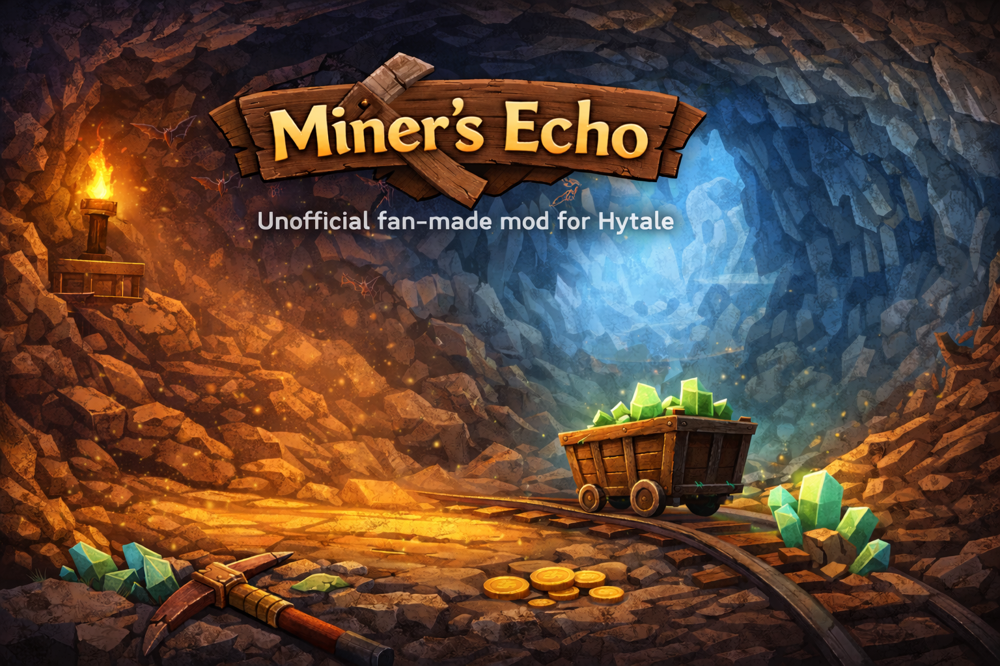

# Miner's Echo

A lightweight fan-made Hytale mod focused on underground mineral echo visualization.



## About

**Miner Echo** is a custom Hytale gameplay project built around an artifact-based scanning mechanic that reveals underground rock and mineral structures.

The goal of the first version was clear: create a working in-game artifact that allows the player to preview selected underground block areas and support mineral discovery in a more experimental, gameplay-driven way.

## Version

**Current release:** `v1.0.0`

Version 1 is considered **complete for its original scope**.  
It successfully delivers the intended core mechanic: **previewing rocks and mineral areas through a custom artifact interaction**.

Future versions may expand the idea further, but this release already fulfills the main gameplay and technical objectives defined for the first milestone.

## Core Idea

Miner Echo was designed as a custom artifact that works like a primitive sonar or geological scanner.

When activated, it processes a selected area and temporarily reveals the underground block structure, making it easier to inspect rock formations and mineral-related zones.

This creates a more interactive and system-driven alternative to traditional resource checking.

## Features in v1.0.0

- custom artifact item integrated into the Hytale asset pack
- custom model and icon support
- right-click artifact interaction
- target block detection
- 3×3×3 area scanning
- temporary underground structure reveal
- support for previewing rock and mineral zones
- delayed restoration of modified blocks
- activation sound feedback
- cooldown protection against spam
- modular Java plugin structure for further expansion

## What v1.0.0 Achieves

This version completes the original design target:

- the artifact exists as a usable in-game item
- the interaction works correctly
- the scan reveals underground structure in a readable way
- the player can inspect rock and mineral-related areas
- the mechanic is functional enough to serve as a finished first release

That makes `v1.0.0` a valid standalone milestone, not just an unfinished prototype.

## Technical Highlights

Miner Echo combines several layers of implementation:

- Java gameplay scripting / plugin logic
- Hytale interaction system integration
- chunk and block manipulation
- delayed block restoration
- cooldown and activation flow control
- custom asset pack setup
- custom item model pipeline

## Repository Layout

- `docs/` — project notes and documentation
- `java-core/` — active Hytale plugin code, asset pack, build script and packaged JAR
- `prototype/` — earlier prototype work
- `tests/` — test-related files

## How to Run

This repository contains the full project source, while the playable plugin build is handled from the `java-core` directory.

### 1. Clone the repository

```bash
git clone https://github.com/grzegorz-krajewski/hytale-miners-echo.git
cd hytale-miners-echo/java-core
```

### 2. Run the build script

```bash
./build.sh
```

The script compiles the Java sources, creates the plugin JAR, and copies both the JAR and asset pack into the local Hytale server `mods` directory used in the current setup.

## Current Local Setup

The current local development setup is wired to a Hytale server environment located at:

```bash
/Users/grzegorz/Projects/hytale-server/
```

The build output is copied into:

```bash
/Users/grzegorz/Projects/hytale-server/mods/
```

## Contents of `java-core`

The `java-core` directory currently includes:

- `src/main/` — main Java source code
- `assetpack/` — custom Hytale assets used by the plugin
- `build.sh` — build and deployment script
- `MinerEchoPlugin.jar` — packaged plugin artifact
- `out/` — compiled output directory

## Notes

- The current setup is tailored to the local development environment used for this project.
- If you want to run it on another machine, update the paths inside `java-core/build.sh`.
- After building, start or restart the local Hytale server to load the updated plugin version.

## Project Structure

- `MinerEchoPlugin` — plugin bootstrap and registration
- `MinerEchoArtifactInteraction` — artifact use handling
- `MinerEchoEffect` — scan / reveal logic
- asset pack files — item definition, model, icon and interaction configuration

## Design Focus

The first version focused on one thing:

**make the reveal mechanic work in-game in a form that is usable, understandable, and expandable.**

Instead of overbuilding the system too early, the project prioritised:

- working gameplay interaction
- visible environmental feedback
- reliable block restoration
- clean separation between code and asset logic
- solid base for future versions

## Future Versions

Version 1 is complete.

Future updates may extend the system with ideas such as:

- more advanced ore-only detection
- better visual highlighting
- refined reveal presentation
- improved collision handling
- more artifact variants
- larger or different scan patterns
- richer sound and FX feedback

These are extensions of an already working system, not requirements for v1.

## Tech Stack

- **Java**
- **Hytale server mod/plugin architecture**
- **Custom asset pack**
- **Blockymodel-based custom content**

## Status

**Released as v1.0.0**  
**Scope completed:** underground rock and mineral preview mechanic

## Author

**Grzegorz Krajewski**

Backend and systems-focused developer exploring gameplay mechanics, modding workflows, and interactive technical design.
